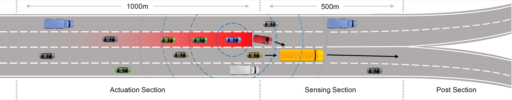
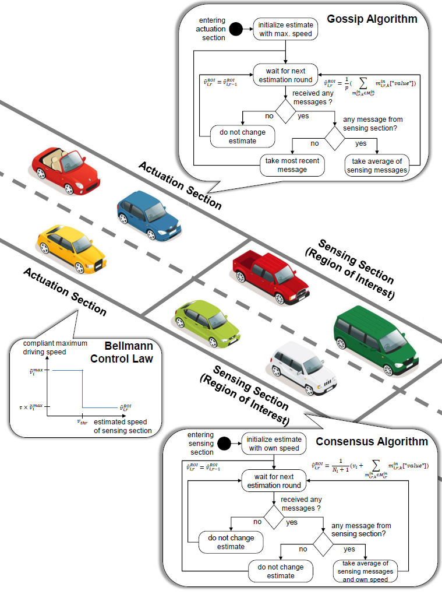

# V2VSL - Decentralized Variable Speed Limit Control
## Highway Decongestion with Variable Speed Limit Control – A Decentralized, Model- & Infrastructure-Free Approach

**Authors:**        Kevin Riehl, Davide Pusino, Anastasios Kouvelas, Michail A. Makridis

**Organization:**   ETH Zürich, Switzerland, Institute for Transport Planning and Systems (IVT)

----------

### Background
Traffic congestion is a pertinent issue on highways.
Variable Speed Limit control can support in avoiding traffic jams before congestion formation.
Vehicles upstream are required to decelerate at times, in order to stop emerging congestion from propagating.
This work proposes a fully decentralized, model-free, and infrastructure-free approach to Variable Speed Limit control, that employs connected vehicles as communication infrastructure, and as moving sensors and actuators.
Dedicated Short Range Communication, consensus, and gossip algorithms, and a Bellman controller are components of this approach.
At the example of a highway bifurcation, performance, and robustness are demonstrated by micro-simulations.
The proposed method achieves significant improvements of traffic states, with up to 15\% higher speeds, 5\% lower density, and 8\% higher flows.
Significant improvements can be achieved at a compliance rate of at least 25\% of all vehicles.
Moreover, the approach is robust to gaps between platoons and recovers from periods of disconnection.
The proposed method achieves traffic improvements similar to previous, centralized approaches, without the necessity of any infrastructure or model knowledge.




### Technology
The decentralized approach is infrastructure-free and model-free, it requires solely vehicle-2-vehicle connected vehicles, and builds upon following technologies:

<table border="1" style="width:100%; border-collapse:collapse;">
  <tr>
    <td style="vertical-align:top; padding:10px;">
      <ul>
        <li><strong>Communication</strong>
          <ul>
            <li>Dedicated short range communication (DSRC)</li>
          </ul>
        </li>
        <li><strong>State Estimation</strong>
          <ul>
            <li>Discrete time consensus algorithm</li>
          </ul>
        </li>
        <li><strong>Information Dissemination</strong>
          <ul>
            <li>Gossip algorithm</li>
          </ul>
        </li>
        <li><strong>Actuation</strong>
          <ul>
            <li>Bellman control law (two-point, bang-bang)</li>
          </ul>
        </li>
      </ul>
    </td>
    <td style="text-align:center; vertical-align:middle;">
      <a href="figures/algorithm.PNG">  </a>
    </td>
  </tr>
</table>

### What you will find in this repository
In this repository you will find a Python implementation of the proposed decentralized variable speed limit control.
In the folder "src" you can find the Python source code, and the in the folder "src/sumo_map" you will find relevant, map-related material, that was used for the case study example of a highway bifurcation in the paper.

### Installation & Usage
We recommend the usage of Python3.8.5 (but any python3 version should be fine). You can install the software using:
```
pip install -r requirements.txt
```

After specifying the installation path to your SUMO simulator, you can run the software as follows:
```
python run_simulation.py
```

Note:
It is also possible to run SUMO in the GUI mode (sumo-gui.exe), which allows you to observe the roads and cars during the simulation.

### Simulation Output

In case you uncomment the lines beginning from line 590, you will get an output with several statistics for your convenience as follows:
```
++++ Traffic State on Average ++++
Vehicles    1000   #
Speed       80.34  km/h
Flow        502.23 veh/h
Density     124.53 veh/km

++++ Communication Statistics ++++
Have an Opinion in SENSE Area   98.24 %
Have an Opinion in ACTUA Area   99.99 %
Average Age in ACTUA Area       5     sec
Maximum Age in ACTUA Area       50    sec

++++ SENSE Area Speed Estimation Mean Absolute Error ++++
Absolute, in SENSE AREA     5.47  km/h
Absolute, in ACTUA AREA     9.83  km/h
Relative, in SENSE AREA     6.81  %
Relative, in ACTUA AREA     12.24 %
```

### Simulation Parameters
You can define following simulation parameters:
- **Vehicle-Spawning-Specific**
  - $\alpha$ *SHARE_CONNECTED* **[%]**  how many of vehicles are connected via DSRC
  - $\gamma$ *SHARE_COMPLIANT* **[%]**  how many of the connected vehicles comply with control
  - *SPAWN_FLOW_PER_ROUTE* **[veh/h]** equals one fourth of per lane in-flow reported in paper
- **Communication-Specific**
  - $d_c$ *DSRC_COMM_DIST* **[m]** maximum communication distance for DSRC
  - $t_r$ *DSRC_COMM_PERIOD* **[sec]** every n seconds transaction of message takes place
  - *DSRC_COMM_ITERATIONS_PER_ROUND* **[#]** if DSRC_COMM_PERIOD = 1, and want more than once per second, then increase here
  - $a_{max}$ *MAX_CONSIDERED_INFO_AGE* **[sec]** maximum considered information age, if older, not considered anymore by vehicles in acutation section
- **Control-Specific**
  - $v_{thr}$ *SPEED_CONTROL_THRESHOLD* **[km/h]** if estimated ROI speed drops below this threshold, compliant vehicle in actuation section will start to decelerate
  - $\tau$ *SPEED_CONTROL_SLOW_FACTOR* **[%]** reduce speed to share of vehicle's default max speed (~100km/h)
- **Simulation-Specific**
  - *WARMUP_TIME* **[sec]** simulation run-time to get traffic in equilibrium-state, before recording should not be considered
  - *SIMULATION_TIME* **[sec]** simulation run-time / duration 
  - *SHALL_RECORD_COMMUNI* **[boolean]** turn on/off recording of communication 
  - *SHALL_RECORD_OPINION* **[boolean]** turn on/off recording of opinion
  - *SHALL_EXECUTE_CONTROL* **[boolean]** turn on/off control law for compliant vehicles
  - *SHALL_EXECUTE_COMMUNI* **[boolean]** turn on/off communication between vehicles

### Acknowledgements
We thank Giulia De Pasquale, Carlo Cenedese, Michail A. Makridis, and Anastasios Kouvelas for their useful feedback and valuable support.
Moreover, we thank Prof. Florian Dörfler for his lecture on *Advanced Topics in Control* at ETH Zürich.

### Citation
```
@article{riehlpusino2026,
  title={V2VSL -- Infrastructure-Free, Decentralized Variable Speed Limit Control},
  author={Riehl, Kevin and Pusino, Davide and Kouvelas, Anastasios and Makridis, Michail A.},
  journal={Data Science for Transporation},
  year={2026}
} ```